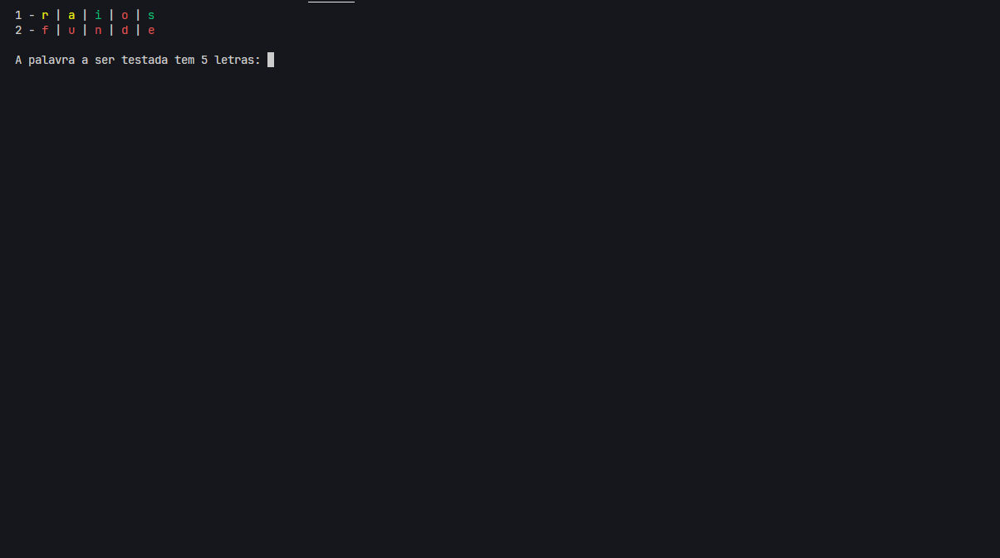
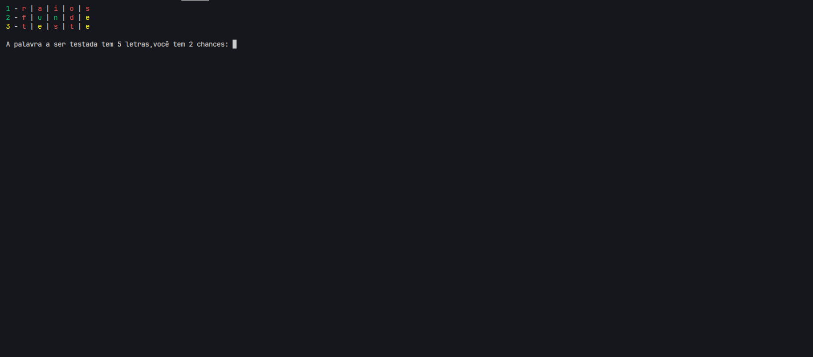

# Termo

Esse projeto foi feito com o intuito de aprender go e entender melhor seus conceitos

## Sobre

Esse projeto é um clone do jogo [Termo](https://term.ooo) porem feito no terminal.

## Como iniciar a aplicação

Clone o projeto:
> git clone https://github.com/fmchtt/termo.git

Instale as dependencias: 
> go mod tidy

Execute a aplicação:
> go run ./main.go

## Como usar

Para jogar com chances habilitadas basta adicionar o argumento *--chances*

Exemplo:
> go run ./main.go --chances 5

Para jogar com uma quantidade de letras personalizado basta adicionar o argumento *--letters*

Exemplo:
> go run ./main.go --letters 6